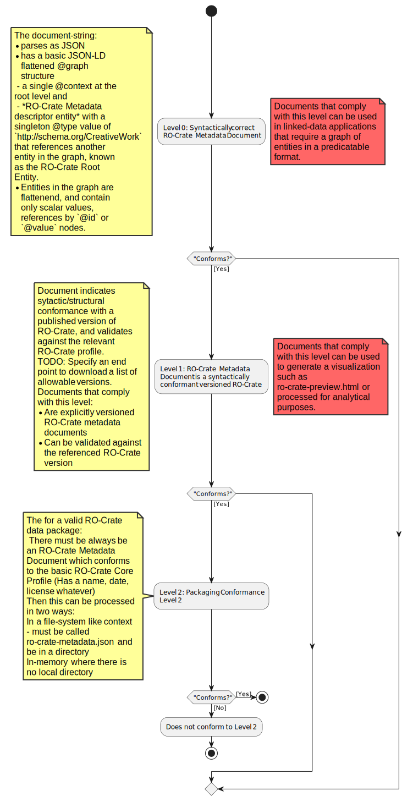

# RO-Crate metadata document    

This part of the RO-Crate specification sets out the requirements for a document (a string) to be considered an RO-Crate Metadata Document.

There are three conformance levels as shown in this summary:

## Conformance Level 0: Syntactically correct RO-Crate Metadata Document <a name='#rule:roc-metadata-doc'>

### Summary

The document-string:

- parses as JSON
- has a basic JSON-LD flattened @graph structure 
 - a single @context at the root level and 
 - *RO-Crate Metadata descriptor entity* with a singleton @type value of `http://schema.org/CreativeWork` that references another entity in the graph, known as the RO-Crate Root Entity. 
- Entities in the graph are flattenend, and contain only scalar values, references by `@id` or `@value` nodes. 

### Exit point
Documents that comply with this level can be used in linked-data applications that require a graph of entities in a predicatable format.

### Rule: Document is JSON-LD <a name='#rule:roc-metadata-doc-is-JSON'>

#### Rule: Document has a @context key <a name='#rule:roc-metadata-doc-has-context'>

The @context may be a single scalar value or an array.

One of the values must be an RO-Crate specification versioned URI

TODO: Can the be an unversioned "I'm and RO-Crate URI"???

##### Rule: @context includes an RO-Crate URI  <a name='#rule:roc-metadata-doc-has-ro-crate-context'>

### Rule: Document has a @graph key <a name='#rule:roc-metadata-doc-is-JSON'>

#### Rule: @graph is an array <a name='#rule:@graph-is-array'>

#### Rule: @graph contains a RO-Crate Metadata Descriptor <a name='#rule:@graph-is-array'>

NOTE: thinking to relax the defintion of Root Data Entity to have just the @id and about props as described here - conformance to a particular RO-Crate version cn be check using MASP once we have met 

#### Rule: Each entity is conformant <a name='#rule:graph-entities-conform'>

For each entity the following must be true
##### Rule: Entity conforms <a name='#rule:entity-conforms'>

###### Rule: Entity has an @id <a name='#rule:entity-id'>

####### Rule: File Entity id is a path or a URI <a name='#rule:file-ntity-id'>

IF the entity is @type resolves to http://Schema.org/MediaObject using the JSON-LD context resolution rules AND the value contains "File" 

####### Rule: file Entity id is a path or a URI <a name='#rule:filentity-id'>

## Conformance Level 1:  RO-Crate Metadata Document is a syntactically conformant versioned RO-Crate  <a name='#rule:roc-metadata-doc-is-an-ro-crate'>

### Summary
Document indicates sytactic/structural conformance with a published version of RO-Crate, and validates against the relevant RO-Crate profile.

TODO: Specify an end point to download a list of allowable versions.

### Exit point
Documents that comply with this level can be used to generate a visualization such as ro-crate-preview.html or processed for analytical purposes.

### Summary
Documents that comply with this level:
-   Are explicitly versioned RO-Crate metadata documents
-  Can be validated against the referenced RO-Crate version

### Rule: <a name='#rule:metadata-descriptor-has-conformsTo'>

#### Rule: conformsTo includes a published RO-Crate specification URI <a name='#rule:conformsTo-includes-published-spec-uri'>

#### Rule: RO-Crate version URI is recognized as allowable <a name='#rule:ro-crate-version-uri-recognized'>

### Rule: RO-Crate Metadata-document validates agains the relevant versioned RO-Crate <a name='#rule:metadata-doc-validates-against-versioned-ro-crate'>

## Conformance Level 2: Packaging Conformance Level 2

NOTE: Looks like a data package has correct IDs on File and Dataset etc but no SEMANTIC checking yet - ie do the files exist.

### Summary
The for a valid RO-Crate data package:
 There must be always be an RO-Crate Metadata Document which conforms to the basic RO-Crate Core Profile (Has a name, date, license whatever)
Then this can be processed in two ways:
In a file-system like context - must be called ro-crate-metadata.json and be in a directory
In-memory where there is no local directory

### Rule: Metadata document conforms to basic RO-Crate Core MASP Profile <a name='#rule:metadata-document-conforms-basic-core-profile'>

- Minimum metadata on root data entity
name, date etc

File entity @id constraints  must be a URI, full or relative -- not # not _

NOTE: MASP can't do this yet needs regex language use SCHACL's version?

SHACL regex is SPARQL https://www.w3.org/TR/sparql11-query/#func-regex -- which is XPath/XQuery 

#### Rule: Attached mode packaging constraints are satisfied <a name='#rule:attached-mode-constraints-satisfied'>

##### Rule: metadata file is named ro-crate-metadata.json <a name='#rule:metadata-file-name-ro-crate-metadata-json'>

##### Rule: metadata file is in the RO-Crate root directory <a name='#rule:metadata-file-in-ro-crate-root'>

#### Rule: In-memory mode packaging constraints are satisfied <a name='#rule:in-memory-mode-constraints-satisfied'>

##### Rule: document can be processed without local directory assumptions <a name='#rule:process-without-local-directory-assumptions'>

Other general guidance (how do I represent people’s contributions, funding, provenance) covered in a series of general-purpose MASP schemas and profiles which may be illustrative or formal.

Define ro-crate-metadata document

It’s “detached” when you first parse it - this is a SYNTACTIC SPEC - it makes no mention of the @type of ANY entity except the CreativeWork “metadata descriptor” and for backwards compatibility Dataset is a blessed entity.
It's JSON
It's JSON-LD
It has a flattened graph (no nesting beyond @value objects)
Each item has an id and a type

